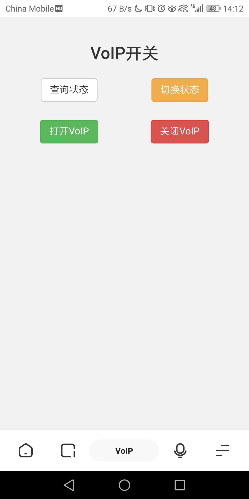
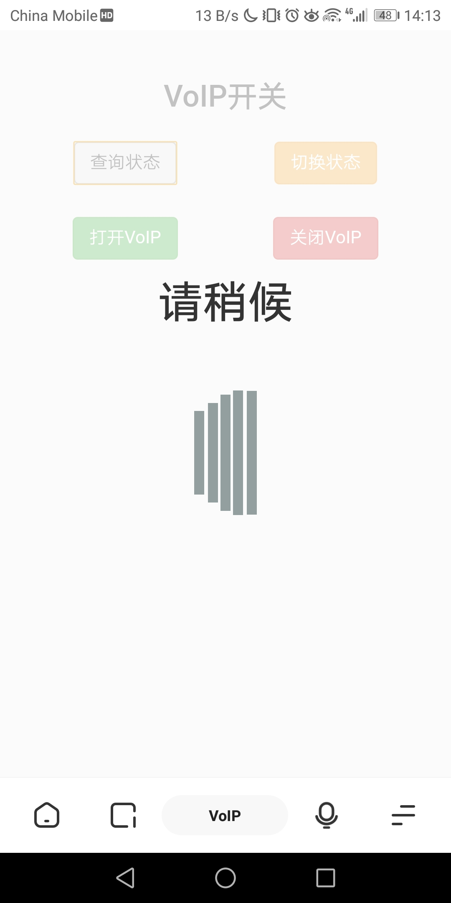

# 定时开关VoIP固定电话(上海电信中兴F450G光猫)

原文位于[https://www.zhouii.com/2020/03/1975.html](https://www.zhouii.com/2020/03/1975.html)

某日深夜家里的固定电话响起了铃声吵醒了全家，我突然发现固定电话尽管已从PSTN升级成走光纤的VoIP，但依然不能像手机那样设置丰富的定时情景模式，例如夜晚某时段静音只允许某些联系人的电话响铃等等。

技术上其实是可以的，但得上昂贵的企业级电话应答系统。对于低成本方案，只能做到定时开关VoIP，不过这已经满足我的需求了。把方法分享给大家，欢迎使用。（这其实也能通过每天睡觉前撂起电话、睡醒后放回电话实现，但如果忘了的话就可能导致别人一整天打不进电话或者晚上被电话吵醒，况且通过程序实现才符合我的身份

需要注意的是本方法适用于中兴F450G光猫，如果光猫不是这款的话你就不是本文针对目标。可能此方法还使用其他中兴光猫，请自行探索

## 准备工作
- 光猫超级管理员账户telecomadmin的密码，如果没有可以查看[上海电信所发中兴F450G光猫破解方法](https://www.zhouii.com/2018/10/646.html)
- 内网中常开的一台任何能运行Python3的设备，例如刷了某些固件的无线路由器、NAS、树莓派等等
- 此设备安装好Python3的[requests库](https://www.zhouii.com/go/https://requests.readthedocs.io/zh_CN/latest/)

## 部署程序
部署非常简单，只需两步

1、打开[https://github.com/zhouii/VoIP](https://github.com/zhouii/VoIP)下载我编写的voip.py到设备的任意目录

2、将`/path/to/voip.py -p PASSWORD enable`命令设置在每天需要开启电话的时间执行，将`/path/to/voip.py -p PASSWORD disable`命令设置在每天需要关闭电话的时间执行（其中PASSWORD处填入光猫telecomadmin账户的密码）

例如Linux系统可在crontab中添加如下两条使固定电话在每天8:00开启，在每天22:30关闭：

    0 8 * * * python3 /path/to/voip.py -p PASSWORD enable > /dev/null 2>&1 &
    30 22 * * * python3 /path/to/voip.py -p PASSWORD disable > /dev/null 2>&1 &
Windows系统可在任务计划程序添加相应设置。不同系统有不同方法让命令定时运行，各种系统不同的设置方法就不在本文探讨范围内了

## VOIP.PY说明
voip.py可接受3个可选参数：

- 通过-p PASSWORD或--password PASSWORD指定telecomadmin账户的密码
- 通过-i IP或--ip IP指定光猫的IP地址，如果不是默认的192.168.1.1就需要了
- 通过-l LOG 或--log LOG指定日志的保存路径，默认会保存在当前目录voip.log

如果不想把参数放在命令中也可修改voip.py第11\~13行内容，不在命令行指定参数就会按程序第11\~13行的参数执行

voip.py可进行4种操作：

- query：查询当前状态
- enable：开启VoIP
- disable：关闭VoIP
- switch：切换状态，如果VoIP处于开启状态就关闭，反之亦然

在每种操作执行完毕后都会输出和向系统返回操作执行之后VoIP的状态，1表示关闭，2表示开启，其他表示出错

以上voip.py的使用说明也可通过执行voip.py -h或voip.py --help查看，不过出于控制台兼容性的考虑，命令行查看的说明是英文版的

## 高阶玩法
1、voip.py可作为子模块导入父程序，只需在父程序中`import voip`即可

可使用`voip.query()`查询当前状态、`voip.enable()`开启VoIP、`voip.disable()`关闭VoIP、`voip.switch()`切换状态

同样，函数也会在每种操作执行完毕后返回操作执行之后VoIP的状态，返回值1表示关闭，2表示开启，其他表示出错

2、如果设备有PHP环境，可将voip.php部署到网站供内网访问。

  

voip.php能调用voip.py的四种操作，在某些不方便执行命令行的情况下通过Web控制VoIP可在某些临时情况下快速开关固定电话

如果要把voip.php和voip.py放在不同目录需注意修改voip.php中voip.py的路径

2020年3月12日

## DONATE

